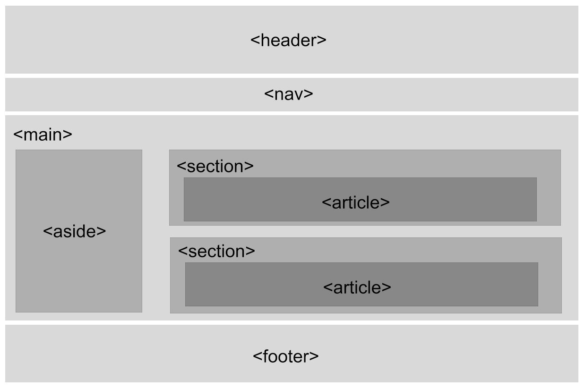

# 📃 HTML

<details>
<summary>목차</summary>

[1. HTML이란 무엇일까요?](#1-html이란-무엇일까요)

- [1-1. HTML의 기본 구성](#1-1-html의-기본-구성)
- [1-2. HTML 요소 타입](#1-2-html-요소-타입)


[2. HTML의 태그](#2-html의-태그)

- [2-1. 글자 태그](#2-1-글자-태그)
- [2-2. 목록 태그](#2-2-목록-태그)
- [2-3. 표 태그](#2-3-표-태그)
- [2-4. 이미지 태그](#2-4-이미지-태그)
- [2-5. 폼 태그](#2-5-폼-태그)
- [2-6. 시멘틱 태그](#2-6-시멘틱-태그)

[3. HTML 특수 기호](#3-html-특수-기호)

</details>

<br><br><br><hr><hr>


> # 1. HTML이란 무엇일까요?
HTML(Hyper-Text Markup Language)

- 웹 브라우저에 표시되도록 설계된 문서의 표준 마크업 언어
    ##### 마크업 언어 : 태그 등을 이용해 문서나 데이터의 구조를 명시하기 위한 규칙을 정리한 언어

<br><hr>

>> ## 1-1. HTML의 기본 구성

|요소|의미|예시|
|-|-|-|
|태그(tag)|'<>'로 둘러싸인 문자열로 시작태그(<>)와 종료태그(</>)로 구성|**<h1<k>></h1<k>>**|
|내용(content)|태그로 둘러싸인 문자열|<h1<k>>**Hi**</h1<k>>|
|요소(element)|태그와 내용을 다 포함한 전체 문자열, HTML문서의 기본 구성 단위|**<h1<k>>Hi</h1<k>>**|
|속성(attribute)|엘리먼트의 상세한 기능을 시작 태그 안에서 사용|<h1 **color**="blue">Hi</h1<k>>|
|속성값(value)|속성 값('' 또는 ""로 감쌈)|<h1 color=**"blue"**>Hi</h1<k>>|

<details>
<summary>💌 HTML 기본 구성</summary>

```html
<!DOCTYPE html>

<html lang = "ko">

    <head>
        <meta charset="UTF-8">
        <title>문서 제목</title>
        <link rel="stylesheet" href="#">
        <style> /* CSS 적는 공간 */ </style>
        <script> // script 적는 공간(jQuery, JavaScript 등) </script>
    </head>

    <body>
        <!-- 여기 적힌 것들이 뷰포트에 나옴 -->
    </body>
</html>
```

</details>

<br>

- `<!DOCTYPE html>` : 문서 형식(document type) 선언: 브라우저에게 이 문서가 HTML5 문서임을 알림

- `<html>` 요소: HTML 문서의 최상위 요소

- `<head>` 요소: HTML 문서의 정보를 표현하는 요소들의 묶음
    - `<meta>` 
        : HTML 문서의 메타 데이터를 표현
        - HTML 문서의 문자 인코딩을 브라우저에게 알려주기 위해 사용하는데 기본 문자 인코딩은 UTF-8(제대로 명시)
    - `<title>`
        : HTML 문서의 제목<br>
        - 페이지를 방문자나 검색 엔진은 제목을 보고 내용을 예측해서 들어옴
    - `<link>`
        : HTML 문서에 다른 파일 연결(외부 CSS파일 등)
    - `<style>`
        : HTML 문서에 스타일 시트 추가(CSS 적는 공간)
    - `<script>`
        : HTML 문서에 스크립트 추가

- `<body>` 요소: 브라우저 화면(viewport)에 표시되는 요소들의 묶음

<br><hr>

>> ## 1-2. HTML 요소 타입
- 블록(block)요소 : `dispaly:block;`

    - 해당 행의 모든 너비 차지  
    ex) `<p> <div> <h> <ul> <ol> <li> <form> <header> <nav> <article> <section> <footer>`

    - `width, height, margin, padding` 등 사용해서 레이아웃 수정 가능

    - `text-align` 적용 안됨

        - `<div>` : 요소들의 스타일을 한 번에 적용하기 위해 사용
    
    - 상하좌우 마진 & 패딩 가능

    - 가운데 정렬 방법은 `margin: auto;`

<br>


- 인라인(inline)요소 : `display:inline;`

    - 해당 HTML 요소의 내용 너비 차지  
    ex) `<a>  <input> <label> <span> <strong>`

    - 컨텐츠가 끝나는 지점가지 넓이로 가지기 때문에 `width, height` 변형 불가능

    - `line-hegith`로 줄 높낮이 조절 가능

    - `text-align`으로 텍스트 중앙, 좌측, 우측 정렬 가능

        - `<span>` : 특정 부분에 따로 스타일을 적용하기 위해 사용

    - 상하 마진 적용 불가능, 좌우 마진 & 상하좌우 패딩 가능

    - 가운데 정렬 방법은 부모 요소에 `text-align: center`


<br><br><br><hr><hr>

> # 2. HTML의 태그

- '<>'로 둘러싸인 문자열로 시작태그(<>)와 종료태그(</>)로 구성

<br><hr>

>> ## 2-1. 글자 태그
- HTML 문서에서 가장 큰 비중을 차지

    |종류|태그|
    |-|-|
    |제목|`<h1>~<h6>`|
    |본문|`<p>, <br>, <hr>`|
    |앵커|`<a>`|
    |글자 형태|`<b>, <strong>, <i>, <em>, <small>, <mark>, <sub>, <sup> 등`|

- 제목
    - `<hn>` : 제목(headings)

        `<h1> ~ <h6>` 까지 있으며 `<h1>`이 제일 크고 `<h6>`이 제일 작음
        - 페이지에서 특별한 제목이 되는거라 `<h1>`은 가능하면 가장 크고 중요한 한 번만 부분에 걸어주는 게 좋음 (다른 것들은 여러번 나와도 됨)

        <details>
        <summary>💌 hn 예시</summary>

        ```HTML
        <h1>Hello</h1>
        ```

        </details>

- 본문
    - `<p>` : 단락(paragraph)
        블럭 레벨(후에 더 자세한 설명)

        <details>
        <summary>💌 p 예시</summary>

        ```HTML
        <p>
            Hello World
        </p>
        ```

        </details>
        

    - `<br>` : 내부 텍스트의 강제 개행(break)

        <details>
        <summary>💌 br 예시</summary>

        ```HTML
        <p>
            Hello<br>
            World
        </p>
        ```

        </details>


    - `<hr>` : 가로 구분선(horizontal break)

        <details>
        <summary>💌 hr 예시</summary>

        ```HTML
        <hr>
        <h1>Hello</h1>
        ```

        </details>
        
- 앵커
    - `<a>` : 외부 연결(hyper-link)
    - 서로 다른 HTML 문서 사이를 이동하거나 HTML 문서 내부에서 특정한 위치로 이동할 때 사용
        - href 속성: 외부 연결 URL(원격 참조 URL; hyper-reference) 설정

        <details>
        <summary>💌 a 예시</summary>

        ```HTML
        <!-- 문서 외부로 이동 -->
        <a href="https://www.naver.com">네이버</a>

        <!-- 문서 내부에서 이동 -->
        <a href="#">문서의 상단으로 이동</a>
        <a href="#here">id 속성이 "here"인 요소로 이동</a>
        ```

        </details>

- 글자 형태
    - `<b>` : 의미 없이 내용을 진하게 표시
    - `<strong>` : 중요하고 긴급한 내용을 강조, 웹 페이지의 내용 중 강조하고 싶은 부분이 있을 때 사용
    - `<i>` : 의미 없이 기울임 꼴로 표시
    - `<em>` : 내용의 강조를 위해 기울임 꼴로 표시
    - `<small>` : 기본 글자보다 작은 text로 지정
    - `<mark>` : highlighted text로 지정
    - `<sub>` : 기본 글자보다 아래에 쓰인 텍스트로 지정
    - `<sup>` : 기본 글자보다 위에 쓰인 텍스트로 지정

<br><hr>

>> ## 2-2. 목록 태그
- 비슷한 것들끼리 묶어서 사용

    |태그|의미|설명|
    |-|-|-|
    |`<ul>`|unordered list|순서가 없는 목록|
    |`<ol>`|ordered list|순서가 있는 목록|
    |`<li>`|list item|목록 요소|
    |`<dl>`|definition list|정의 목록|
    |`<dt>`|definition term|정의 용어|
    |`<dd>`|definition description|정의 설명|

    ##### `<ul>`요소나 `<ol>`요소에는 `<li>`요소만 들어갈 수 있음
    ##### `<dl>`요소에는 `<dt>`요소와 `<dd>`요소만 들어갈 수 있음

- `<ul>` : 순서가 없는 목록(unordered list)

    <details>
    <summary>💌 ul 예시</summary>
    
    ```HTML
    <ul>
        <li>HTML</li>
        <li>CSS</li>
    </ul>
    ```

    </details>

- `<ol>` : 순서가 있는 목록(ordered list)
    
    <details>
    <summary>💌 ol 예시</summary>

    ```HTML
    <ol>
        <li>HTML</li>
        <li>CSS</li>
    </ol>
    ```
    
    </details>

- 중첩된 목록: 목록 안에 목록이 들어가는 형태

    <details>
    <summary>💌 중첩된 목록 예시</summary>
    
    ```HTML
    <ul>
        <li>HTML
            <!-- 안쪽 목록은 반드시 <li>요소 안에 들어가야 함 -->
            <ul>
                <li>HTML Tutorial</li>
                <li>HTML Elements</li>
            </ul>
        </li>
        <li>CSS
            <ul>
                <li>CSS Tutorial</li>
                <li>CSS blocks</li>
            </ul>
        </li>
    </ul>
    ```

    </details>

- `<dl>` : 정의 목록(definition list)

    <details>
    <summary>💌 dl 예시</summary>
    
    ```HTML
    <!-- 정의 목록 -->
    <dl>
        <!-- 정의 용어 -->
        <dt>HTML</dt>

        <!-- 용어 설명 -->
        <dd>HTML stands for Hyper Text Markup Language</dd>
        <dd>HTML describes the structure of a Web page</dd>
    </dl>
    ```

    </details>

#### 예제: 01_list.html    

<br><hr>

>> ## 2-3. 표 태그

|태그|의미|설명|
|-|-|-|
|`<table>`||표(Table)를 작성하기 위한 기본 태그|
|`<thead>`|table header|표의 제목 행들의 묶음(생략 가능)|
|`<tbody>`|table body|표의 본문 행들의 묶음(생략 불가능)|
|`<tfoot>`|table footer|표의 푸터 행들의 묶음(생략 가능)|
|`<tr>`|table row|표의 행(row) 표현|
|`<th>`|table header|표의 제목 셀을 표현|
|`<td>`|table data|표의 본문 셀을 표현|

- colspan 속성: 열(colums) 확장(오른쪽으로 확장하는거야)
- rowspan 속성: 행(rows) 확장(밑으로 확장하는거야)

##### 표는 HTML 문서에서 구조가 가장 복잡한 콘텐츠라 반드시 필요한 경우에만 사용
#### 예제: 02_table.html

<br><hr>

>> ## 2-4. 이미지 태그
- ``: 이미지 삽입
- 이미지 설정 두 가지 방법
    - 상대경로: 내 컴퓨터에 저장되어 있는 이미지 경로 삽입
    - 절대경로: 다른 웹 페이지의 이미지 주소를 복사해서 삽입

<details>
<summary>💌 img 예시</summary>

```HTML

```

</details>

#### 예제: 03_img.html

<br><hr>

>> ## 2-5. 폼 태그

- HTML5 `<form>` 요소
    - 사용자가 웹사이트에 데이터를 전송 또는 웹 페이지가 입력 데이터를 사용하기 위해 사용

    |태그|설명|
    |-|-|
    |`<form>`|사용자 측에서 입력을 입력하는 HTML 양식 정의
    |`<input>`|입력 컨트롤 정의
    |`<textarea>`|다중 라인 입력 컨트롤 정의
    |`<label>`|입력 요소의 레이블 정의
    |`<fieldset>`|관련 요소를 양식으로 그룹화
    |`<legend>`|`<fieldset>` 요소에 대한 캡션 정의
    |`<select>`|드롭 다운 목록 정의
    |`<optgroup>`|드롭 다운 목록에서 관련 옵션 그룹 정의
    |`<option>`|드롭 다운 목록에서 옵션 정의
    |`<button>`|클릭 가능한 버튼 정의

<br><hr>

- `<form>` 태그
    - 입력 양식 전체를 감싸는 태그

    |속성|설명|
    |-|-|
    |action|전송되는 서버 url 또는 html 링크|
    |method|전송 방식 선택(기본값:get)|
    |name|form의 이름|

- 입력 데이터 전달 방식(method 속성에 적는 것)

    - GET: 입력 데이터를 주소(URL)에 덧붙여서 전달
        - 클라이언트에서 데이터를 이름과 값이 결합된 문자열 형태(query string)로 전달
        - 전송할 수 있는 데이터 양에 한계가 있음
        - 요청 자체를 위한 정보를 전송할 때 사용(예: 데이터베이스에 대한 질의어)
        
    - POST: 입력 데이터를 따로 인코딩 해서 전달
        - 클라이언트에서 데이터를 별도로 인코딩 해서 서버로 전달
        - 전송할 수 있는 데이터 양에 제한이 없음
        - 서버 측에 정보 갱신을 요청할 때 사용(예: 데이터베이스의 갱신)

    <details>
    <summary>💌 form 예시</summary>

    ```HTML
    <form name="form 이름" action="전송될 서버" method="전송 방식">
        <!-- 전송할 정보들 -->
    </form>
    ```

    </details>

<br><hr>


- `<input>` 태그

    |속성|설명|
    |-|-|
    |checked|type 속성이 "checkbox"나 "radio"인 경우 체크된 상태로 표시|
    |disabled|입력 요소를 비활성화|
    |readonly|입력 영역이 읽기만 가능하도록 지정|
    |maxlength|`<input>` 태그의 입력할 수 있는 문자열의 최대 길이를 지정|
    |size|`<input>` 태그의 너비를 지정|
    |autofocus|HTML 문서가 로딩된 후 입력 요소에 자동으로 포커스를 설정|
    |placeholder|`<input>` 태그의 안내 문구를 지정|
    |required|반드시 입력해야 하는 입력 요소를 지정|
    |★type|`<input>` 태그의 타입 지정|

    <details>
    <summary>💌 input 예시</summary>

    ```HTML
    <form>
        name : 
        <!-- 글자수 제한, 필수 입력-->
        <input type="text" name="name" maxLength="5" required> 
        별명 :
        <!-- 태그 안내 문구 -->
        <input type="text" name="alias" placeholder="생략가능">
    </form>
    ```

    </details>

<br>


- `<input>` 태그의 `type` 속성 종류

    |속성|설명|
    |-|-|
    |hidden|서버로 보내는 값들을 보내는 필드(사용자한텐 안 보임)
    |text|한 줄짜리 텍스트를 입력할 수 있는 텍스트 상자
    |search|검색상자(크롬이나 사파리에서만 사용 가능, 다른 곳에선 잘 안돼서 잘 사용하지 않음)
    |tel|전화번호 입력 필드
    |url|URL 주소 입력 필드
    |email|메일주소 입력 필드
    |password|비밀번호 입력 필드
    |number|숫자 입력 필드
    |color|색상 선택 필드
    |checkbox|체크박스(2개 이상 선택 가능)
    |radio|라디오 버튼(1개만 선택 가능)
    |datetime|날짜 선택 선택 필드
    |datetime-locl|지역 날짜 선택 필드
    |month, week, date|월,주,일 선택 필드
    |ragne|범위 선택 필드
    |time|시각 선택 필드

    <details>
    <summary>💌 input태그의 type 속성 예시</summary>

    ```HTML
    <input type="타입 속성">
    ```

    </details>

<br><hr>

- `<textarea>` 태그
    - text 타입과 비슷하지만 text는 한 줄만 가능하고, `<textarea>`태그는 여러 줄의 긴 내용 입력 가능

    |속성|설명|
    |-|-|
    |autofocus|페이지가 로드될 때 자동으로 포커스가 `<textarea>` 요소로 이동
    |cols|텍스트 입력 영역 중 보이는 영역의 너비
    |rows|텍스트 입력 영역 중 보이는 영역의 라인수
    |name|`<textarea>` 요소의 이름
    |disabled|해당 `<textarea>` 요소가 비활성화됨
    |maxlength|`<textarea>` 요소에서 허용되는 최대 문자수
    |placeholder|`<textarea>` 요소에 입력될 값에 대한 짧은 힌트 
    |readonly|`<textarea>` 요소의 텍스트 입력 영역이 읽기 전용임
    |required|폼 데이터가 서버로 제출되기 전 반드시 채워져 있어야 함
    |wrap|폼 데이터가 서버로 제출될 때 입력된 텍스트의 줄바꿈 방식

    <details>
    <summary>💌 textarea 예시</summary>

    ```HTML
    <textarea name="introduce" cols="50" rows="5" placeholder="자기소개 부탁드립니다." required></textarea>
    ```

    </details>

<br><hr>

- `<label>` 태그

    - `<input>`태그를 제어해 상태값을 변경하도록 돕는 역할
    - 예를들면 라디오 버튼 속성을 줬을 때 버튼을 제대로 눌러야 했는데 `<label>` 이용시 `<label>` 안에 있는 글자를 클릭해도 버튼이 클릭된다.

        <details>
        <summary>💌 label 예시</summary>

        ```HTML
        <form name="selectcode">
            <!-- 체크박스를 눌러야 체크가 된다 -->
            <input type="radio" /> HTML

            <!-- 레이블이 있으면 CSS 글자를 클릭해도 버튼이 클릭 됨 -->
            <label>
                <input type="radio" /> CSS
            </label>
        </form>
        ```

        </details>

    - 레이블을 분리 시켜야 하는 경우는 input태그의 아이디를 label의 for에다 적어준다

        <details>
        <summary>💌 label 분리시 예시</summary>

        ```HTML
        <form name="selectcode">
            <input id="codeItem" type="radio" />
            <label for="codeItem">HTML<label>
        </form>
        ```

        </details>

<br><hr>

- `<select>` 태그

    |태그|설명|
    |-|-|
    |`<select>`|선택 양식 생성
    |`<optgroup>`|선택 항목을 그룹화
    |`<option>`|선택 항목

    <details>
    <summary>💌 select 예시</summary>

    ```HTML
    <form action="#" method="get">
        <select name="color">
            <option value="red">Red</option>
            <option value="green">Green</option>
            <option value="blue">Blue</option>
        </select>
    </form>
    ```
    </details>

<br><hr>

- 입력 양식 묶음

    |태그|설명|
    |-|-|
    |`<fieldset>`|입력 양식 묶음
    |`<legend>`|입력 양식 묶음의 제목

    <details>
    <summary>💌 입력 양식 묶음 예시</summary>

    ```HTML
    <form action="#" method="post">
        <fieldset>
            <legend>Login</legend>

            Name: <input type="text" name="name"><br>
            Password: <input type="Password" name="Password"><br>
            <input type="submit" name="login" value="Login">
        </fieldset>
    </form>
    ```
    </details>

#### 예제: 05_form.html    

<br><hr>

>> ## 2-6. 시멘틱 태그
- 컴퓨터가 페이지를 해석할 때 의미를 알 수 있는 태그를 쓰는 것



- `<header>` : 머리글을 뜻함 / 도입부에 해당하는 콘텐츠나 네비게이션 링크 집합

- `<nav>` : 메뉴 / 다른 페이지로 이동

- `<main>` : body 안에 주요 컨텐츠 영역 / IE 지원 불가

- `<aside>` : 사이드 메뉴 / 본문과 구분되는 별도의 구역

- `<article>` : 기사 영역 / 본문의 주 내용이 들어감 / 독립된 내용의 실제 컨텐츠  
ex) 포럼 포스트, 블로그 포스트, 보도기사, 논평

- `<section>` : 특정 탭이 가리키는 영역 등 유사 내용을 담음 / 맥락에 따라 주제별로 컨텐츠를 묶음

- `<footer>` : 작성자, copyright, 문서 링크 정보 등


<br><br><br><hr><hr>

> ## 3. HTML 특수 기호
- HTML 엔티티(entity)
    - HTML 문서에서 특별한 용도로 사용되는 문자나 키보드로 직접 입력할 수 없는 문자를 표기하는 방법

    |문자|엔티티(Entity)
    |-|-|
    |&|`&amp;`
    |<|`&lt;`
    |>|`&gt;`
    ||`&nbsp`
    |@|`&copy`
    |§|`&sect;`